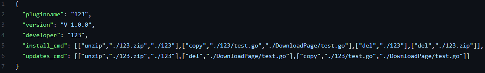

 
# Plugin_Station  
自动化安装插件规范，使用GitHub仓库作为插件储存库  
并且配套了自动安装插件程序，开源于[客户端]文件夹中  
插件作者成为协作者后，按照规范在[Plugin_Station](https://github.com/cmys1109/Plugin-Station)
中提交插件以及插件详情json，客户端程序会按照作者提交的json内容自动安装插件  

插件开发者请注意：  
1. 使用这种办法可能会增加你的工作量，也有可能减少你的工作量 
2. 开发者可以通过这种方法来实现傻瓜式安装插件，无需再在花篇幅去向
使用者介绍如何安装插件
3. 但是如果开发者在编写install_cmd或update_cmd时出现错误可能
会造成错误和使用者的损失。
4. 接入[Plugin_Station](https://github.com/cmys1109/Plugin-Station) ,请联系cmys1109@qq.com

插件使用者注意：
1. 下载发行版，解压至服务器根目录即可
2. 程序开源于<客户端>文件夹内
3. 运行exe后，输入插件名即可下载，这个请查看插件作者所提供的名称
4. 如果发现bug，请联系我

##  客户端使用教程
命令：install   + 空格 + [PluginKey]———————安装插件  
命令：uninstall + 空格 + [PluginKey]——————卸载插件  
命令：update    + 空格 + [PluginKey] —————— 更新插件  
命令：“update -a”—————————————更新所有插件  
命令：“0” ————————————————— 退出程序

插件下载API插件包标准  v220130
------
##  仓库文件存放结构
Plugin文件只能为单个，如果是多个文件可以达成zip压缩包上传。仅限zip，因为客户端解压压缩包方案仅支持zip  

确保Plugin文件名除去后缀后和details.json文件名去除后缀后相同  

例子：插件文件名[123.zip]，详情包名[123.json]  
PluginKey为[123.zip]

Plugin
 ###  --Plugins
 ####  --PluginFile  
 ###  --Details
 ####  --PluginName.json

------

## Detail.json

pluginname:"  "  
version:"  "  
developer:"  "  
cmd:"  "  

example:
 

------
##  cmd规范

cmd为一个二维数组，元素值为string

客户端在拿到detail.json的数据后会解析cmd  
并且按顺序进行操作  

###  注意点：数组中的key请按操作顺序排序！

###  cmd所提供的方法：  

1. 解压，数组内容：["unzip",<压缩包路径>,<解压至路径>]  
将<压缩包路径>的zip包解压至<解压至路径>(不存在会自行创建)  
2. 复制，数组内容：["copy",<文件路径>,<复制至路径>,<复制后命名为>]
3. 删除，数组内容：["del",<文件或目录名>]
##  ！！！切记在结束前删除所需要删除的文件和文件夹！！！
