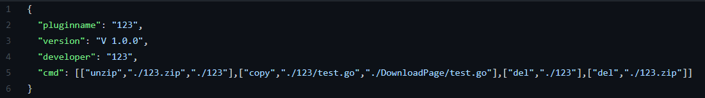

#Plugin_Station  
自动化安装插件规范，使用GitHub仓库作为插件储存库  
并且配套了自动安装插件程序，开源于[客户端]文件夹中  
插件作者成为协作者后，按照规范在[Plugin_Station](https://github.com/cmys1109/Plugin-Station)
中提交插件以及插件详情json，客户端程序会按照作者提交的json内容自动安装插件  

插件作者请注意：  
1. 使用这种办法可能会增加你的工作量，也有可能减少你的工作量  
2. 如果要成为协作者请联系我；邮箱：cmys1109@qq.com

插件使用者注意：
1. 下载发行版，解压至服务器根目录即可
2. 程序开源于<客户端>文件夹内
3. 运行exe后，输入插件名即可下载，这个请查看插件作者所提供的名称
4. 如果发现bug，请联系我

插件下载API插件包标准  v220130
------
##仓库文件存放结构
Plugin文件只能为单个，如果是多个文件可以达成zip压缩包上传。仅限zip，因为客户端解压压缩包方案仅支持zip  
确保Plugin文件名和details.json文件名相同  

如：123.zip，123.json  
客户端安装指令：123.zip

###--Plugins
####--PluginFile  
###--Details
####--PluginName.json

------

## Detail.json

example:
 

下为结构体和json定义：  

------
##cmd规范

cmd是一个由key为string，value为string数组组成的集合  

客户端在拿到detail.json的数据后会解析cmd  
###注意点：数组中的key请按操作顺序排序！

###cmd所提供的方法：  

1. 解压，数组内容：["unzip",<压缩包路径>,<解压至路径>]  
将<压缩包路径>的zip包解压至<解压至路径>(<解压至路径>不存在会自行创建)  
2. 复制，数组内容：["copy",<文件路径>,<复制至路径>,<复制后命名为>]
3. 删除，数组内容：["del",<文件或目录名>]
##！！！切记在结束前删除所需要删除的文件和文件夹！！！
